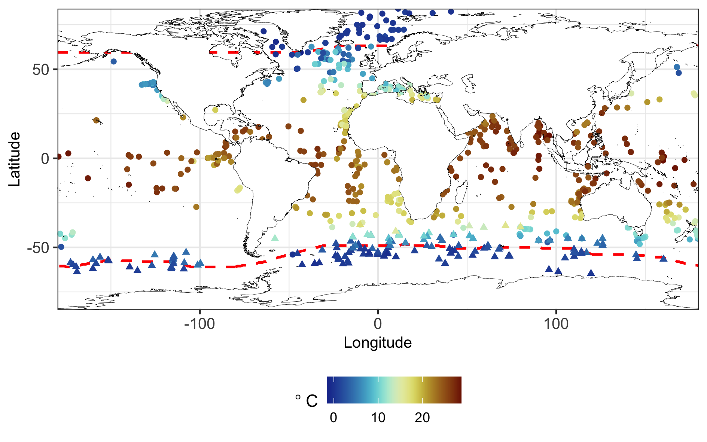

```{r, include = FALSE}
knitr::opts_chunk$set(
  collapse = TRUE,
  comment = "#>",
  fig.path = "man/figures/README-",
  out.width = "100%"
)
```

# Coexchangeable process modelling for uncertainty quantification in joint climate reconstruction

This is the accompanying package to "Coexchangeable process modelling for uncertainty quantification in joint climate reconstruction". This <tt>.rmd</tt> file pre-computes some results; to run the analysis from scratch look in <tt>run_analysis.R</tt>.

# Installation

To execute on your local machine you can install <tt>exanalysis</tt> direct from GitHub:

```{r eval = FALSE}
devtools::install_github("astfalckl/exanalysis")
```

and load:

```{r warning = FALSE, message = FALSE}
library(exanalysis)
```

```{r warning = FALSE, echo = FALSE, message = FALSE}
library(tidyverse)
```

# Data

The package ships with a number of <tt>.rds</tt> files that contain the data used in the paper. Namely,

* <tt>model_data</tt> that contains the PMIP simulation outputs of SST and SIC,
* <tt>sst_data</tt> that contains proxy reconstructions of SST (note the pseudo-observations mentioned in Section 4.2.1 are included here), and
* <tt>sic_data</tt> that contains binary estimates of SIC inferred from Northern and Southern hemisphere maximum sea-ice extents. 

<!--  -->/

# Sea-surface temperature

To calculate the SST belief updates detailed in Section 4.2.1. we use two functions.
The first, <tt>generate_Hx()</tt>, calculates $H_x$ and the second, <tt>calculate_sst_update()</tt>, calculates the belief updates. Our prior belief specifications are stored as a tibble in <tt>params_prior</tt>.

```{r, eval = FALSE}
H_list <- generate_Hx(model_data, sst_data)

sst_prior_params <- tibble(
  tau = 6,
  c = 0.921,
  kappa = 1.61,
  alpha2 = 1
)

sst_update <- calculate_sst_update(
  model_data, sst_data, H_list, sst_prior_params
)
```

# Update sea-ice concentration

Calculating SIC belief updates require a bit more involvement than the SST updates. First, we set the spline basis functions in the <tt>spline_params</tt> objects. The $\hat{\beta}_i$ are calculated from <tt>project_betais</tt>.

```{r, eval = FALSE}
spline_params <- list(
  bounds = c(-1.92, 10),
  knots = c(-1, -0.5, 1.229281),
  degree = 1,
  prior_exp = c(0.40, .40, 0.2, 0, 0)
)

sic_prior_params <- list(
  corW_params = c(6, 4, 1, 0),
  varU_params = c(6, 4, 0.3, 0)
)

betais <- project_betais(sst_update, spline_params)

Xstar <- as.numeric(sst_update$E)

sic_update <- calculate_sic_update(
  sst_update, spline_params, sic_prior_params, betais, Xstar, sic_data
)

```


