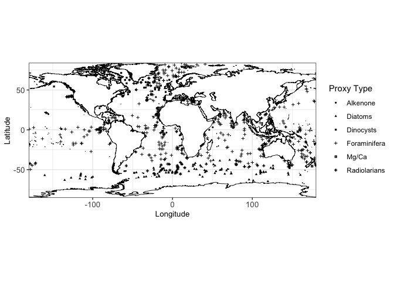

<!-- README.md is generated from README.Rmd. Please edit that file -->

# Coexchangeable process modelling for uncertainty quantification in joint climate reconstruction

<!-- badges: start -->

<!-- badges: end -->

This is the accompanying package to “Coexchangeable process modelling
for uncertainty quantification in joint climate reconstruction”.

# Installation

To execute on your local machine you can install <tt>exanalysis</tt>
direct from GitHub:

``` r
devtools::install_github("astfalckl/exanalysis")
```

# Code run-through

## Update sea-surface temperature

Let us first load <tt> exanalysis </tt> and some other dependencies.

``` r
library(exanalysis)
library(tidyverse)
#> Warning: package 'tidyverse' was built under R version 3.6.2
#> ── Attaching packages ─────────────────────────────────────── tidyverse 1.3.1 ──
#> ✔ ggplot2 3.3.5     ✔ purrr   0.3.4
#> ✔ tibble  3.1.2     ✔ dplyr   1.0.7
#> ✔ tidyr   1.1.3     ✔ stringr 1.4.0
#> ✔ readr   1.4.0     ✔ forcats 0.5.1
#> Warning: package 'ggplot2' was built under R version 3.6.2
#> Warning: package 'tibble' was built under R version 3.6.2
#> Warning: package 'tidyr' was built under R version 3.6.2
#> Warning: package 'readr' was built under R version 3.6.2
#> Warning: package 'purrr' was built under R version 3.6.2
#> Warning: package 'dplyr' was built under R version 3.6.2
#> Warning: package 'forcats' was built under R version 3.6.2
#> ── Conflicts ────────────────────────────────────────── tidyverse_conflicts() ──
#> ✖ dplyr::filter() masks stats::filter()
#> ✖ dplyr::lag()    masks stats::lag()
```

The package ships with a number of rds files that contain the data used
in the paper. Namely, there is

  - <tt> pmip\_sst </tt> that contains the simulation outputs of SST,
  - <tt> margo\_sst </tt> that contains proxy reconstructions of SST
    (note there are some added points to the original MARGO dataset).

These files are all lists that contain useful information to the
analysis. The main contents of these lists are

``` r
as_tibble(margo_sst$data)
#> # A tibble: 766 x 7
#>       lon   lat sst_obs reliability    sd source    type 
#>     <dbl> <dbl>   <dbl>       <dbl> <dbl> <chr>     <chr>
#>  1  -4.31 36.2    11.3            2   1.5 Dinocysts ann  
#>  2 -16.6  62.1     4.68           1   1.5 Dinocysts ann  
#>  3 -21.9  50.7     9.83           2   1.5 Dinocysts ann  
#>  4   5.10 -2.20   26.7            2   1.5 Dinocysts ann  
#>  5 -16.7  52.4     7.08           2   1.5 Dinocysts ann  
#>  6   4.90 66.7     4.54           1   1.5 Dinocysts ann  
#>  7 -29.6  64.8     6.94           1   1.5 Dinocysts ann  
#>  8 -64.3  71.3    -0.16           1   1.5 Dinocysts ann  
#>  9 -57.5  58.4    -0.29           1   1.5 Dinocysts ann  
#> 10 -63.1  42.6     6.36           1   1.5 Dinocysts ann  
#> # … with 756 more rows
```

    #> Loading required package: sp




``` r
as_tibble(pmip_sst$sst)
#> # A tibble: 696,360 x 6
#>      lat   lon  time   sst model       ice
#>    <dbl> <dbl> <dbl> <dbl> <chr>     <dbl>
#>  1 -73.8 -158.     1 -1.87 AWI_PMIP4 0.875
#>  2 -73.8 -158.     2 -1.89 AWI_PMIP4 0.882
#>  3 -73.8 -158.     3 -1.92 AWI_PMIP4 0.952
#>  4 -73.8 -158.     4 -1.92 AWI_PMIP4 0.987
#>  5 -73.8 -158.     5 -1.92 AWI_PMIP4 0.986
#>  6 -73.8 -158.     6 -1.92 AWI_PMIP4 0.987
#>  7 -73.8 -158.     7 -1.92 AWI_PMIP4 0.983
#>  8 -73.8 -158.     8 -1.92 AWI_PMIP4 0.978
#>  9 -73.8 -158.     9 -1.92 AWI_PMIP4 0.971
#> 10 -73.8 -158.    10 -1.92 AWI_PMIP4 0.966
#> # … with 696,350 more rows
```

<!-- First thing is to generate the incidence matrices.


```r
H_list <- generate_H(pmip_sst, margo_sst)
#> Calculating Hs...Calculating Ht...Calculating H...
utils::str(H_list)
#> List of 4
#>  $ Hs         :Formal class 'dgeMatrix' [package "Matrix"] with 4 slots
#>   .. ..@ x       : num [1:6350140] 2.77e-09 -2.71e-10 -2.40e-12 -1.01e-07 9.10e-11 ...
#>   .. ..@ Dim     : int [1:2] 766 8290
#>   .. ..@ Dimnames:List of 2
#>   .. .. ..$ : NULL
#>   .. .. ..$ : NULL
#>   .. ..@ factors : list()
#>  $ Hs_collapse: num [1:766, 1:4145] 2.77e-09 -2.71e-10 -2.40e-12 -1.01e-07 9.10e-11 ...
#>   ..- attr(*, "dimnames")=List of 2
#>   .. ..$ : NULL
#>   .. ..$ : NULL
#>  $ Ht         :Formal class 'dgCMatrix' [package "Matrix"] with 6 slots
#>   .. ..@ i       : int [1:62175] 0 4145 0 4145 0 4145 0 0 0 0 ...
#>   .. ..@ p       : int [1:49741] 0 2 4 6 7 8 9 10 11 12 ...
#>   .. ..@ Dim     : int [1:2] 8290 49740
#>   .. ..@ Dimnames:List of 2
#>   .. .. ..$ : NULL
#>   .. .. ..$ : NULL
#>   .. ..@ x       : num [1:62175] 0.0833 0.3333 0.0833 0.3333 0.0833 ...
#>   .. ..@ factors : list()
#>  $ H          :Formal class 'dgeMatrix' [package "Matrix"] with 4 slots
#>   .. ..@ x       : num [1:38100840] 2.31e-10 -2.26e-11 -2.00e-13 -8.44e-09 7.58e-12 ...
#>   .. ..@ Dim     : int [1:2] 766 49740
#>   .. ..@ Dimnames:List of 2
#>   .. .. ..$ : NULL
#>   .. .. ..$ : NULL
#>   .. ..@ factors : list()
```

Then we optimise our loss to get an estimate of the variance parameters $\alpha$ and $\kappa$. (This is being loaded from memory in the background so I don't have to wait for the fitting procedure when I'm rendering the README)


```r
params_hat <- train_params(sst_model, meas, H_list)
```


```r
params_hat
#> # A tibble: 1 x 4
#>     tau alpha kappa  beta
#>   <dbl> <dbl> <dbl> <dbl>
#> 1     6 0.921  1.61     1
```
 -->

## Update sea-ice concentration
